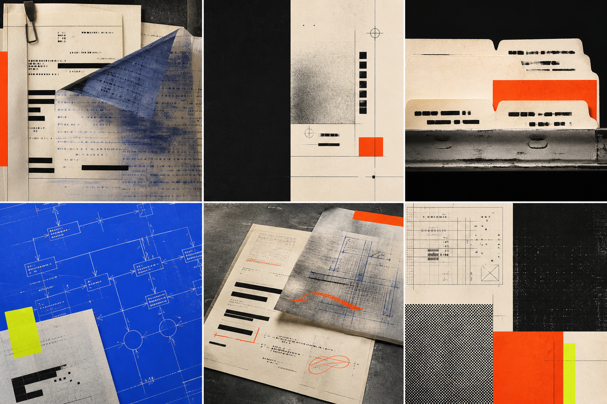

# Dirtyworks.ai creative direction and design brief

**Version:** 0.1  
**Date:** 2026-08-25  
**Audience:** Brand designer, design engine, web designer/developer, presentation designer, photographer, and motion designer  
**Decision status:** `PROOF / WORK` is the recommended territory; logo, final typography licensing, and production system remain to be designed

## Creative objective

Build a visual identity that makes Dirtyworks.ai feel like the company willing to open the black box, label every part, and take responsibility for what happens after launch.

The identity must be bold enough to reject generic B2B AI aesthetics and rigorous enough to discuss company data, permissions, operations, and risk. “Dirty work” must read as necessary backstage craft—not dirt, chaos, low quality, or reckless handling.

## Design thesis: controlled irregularity

Traditional corporate design exposes the grid and hides the work. Dirtyworks.ai should reverse that relationship:

- the underlying system is strict;
- the visible surface feels annotated, cropped, layered, revised, stamped, and alive;
- irregularity is purposeful and repeatable;
- evidence and ownership marks become visual content;
- asymmetry creates energy without sacrificing comprehension.

This is not anti-system. It is a system that leaves the work marks visible.

## Creative territories

### Territory A — `PROOF / WORK` — recommended

**Idea:** Every useful answer is a working proof. Documents, sources, permissions, owners, tests, and changes leave marks. Dirtyworks.ai makes those marks visible.

**Visual world:** editorial evidence board meets industrial print room. Warm paper, carbon black, safety orange, blueprint cobalt, acid verification marks, cropped source fragments, registration targets, file tabs, underlines, redactions, hard rules, hand-applied correction marks, and very large typography.

**Why it fits:**

- makes “work behind AI” visible;
- connects knowledge operations to sources and verification without literal chat bubbles;
- feels bold and proprietary across website and deck;
- supports serious trust content without looking like a bank;
- gives the brand a usable graphic language before case-study photography exists.

**Risk:** can become pseudo-government, legal-document, conspiracy-board, or grunge design. Control with disciplined type, generous negative space, no string-and-pin imagery, no fake classified stamps, and only meaningful labels.

### Territory B — `FIELD MANUAL / 01`

**Idea:** Dirtyworks.ai is the operating manual for company AI—not the machine itself.

**Visual world:** technical manuals, blueprint folds, equipment plates, exploded diagrams, numbered procedures, calibration marks, hi-vis details, rugged bindings, and field-note photography.

**Strength:** natural fit for Alberta energy services and MSP operations; translates well into process diagrams and deck chapters.

**Risk:** may skew industrial, masculine, or safety-branded and make accounting/HR buyers feel secondary. It can also imply that Dirtyworks.ai authors the customer’s authoritative procedures.

### Territory C — `BLACK BOX / OPEN`

**Idea:** The AI interface is a closed black box. Dirtyworks.ai opens the operational layers behind it.

**Visual world:** black fields, translucent planes, X-ray layering, system traces, cutaway components, luminous source paths, stark evidence panels, and precise motion reveals.

**Strength:** most technical and cinematic; strong for decks, motion, and the MSP audience.

**Risk:** easiest to slip into generic cybersecurity, sci-fi, dark-mode SaaS, or neon-AI imagery. It also underplays human knowledge work.

## Direction decision

Use `PROOF / WORK` as the master identity. Borrow procedural numbering and diagram discipline from `FIELD MANUAL / 01`. Reserve the dark, translucent reveal behavior from `BLACK BOX / OPEN` for motion and technical explanation—not the entire brand.

The resulting world should feel like:

> An independent editorial magazine, an industrial proofing desk, and an operations control room designed by the same exacting person.

### Moodboard

This generated moodboard is directional evidence for colour, material, contrast, asymmetry, and texture. It is not a finished identity, logo, interface, licensed stock library, or source of legible document content. The design engine should recreate useful motifs as original vector, photographic, or code-native production assets.

The exact built-in image-generation prompt is preserved in [the moodboard prompt record](../assets/proof-work-moodboard-v1.prompt.md).

## Visual principles

### 1. Evidence is decoration

Sources, owners, dates, versions, statuses, and boundaries are not footnotes. They are the graphic language.

### 2. Scale creates confidence

Use extreme contrast: one huge word, one tiny evidence label, one decisive rule. Avoid a page filled with equally important cards.

### 3. Break the grid selectively

Every composition begins on a rigorous grid. One or two elements may cross columns, crop off-canvas, rotate by 1–3 degrees, or interrupt a rule. Never break alignment everywhere.

### 4. Texture proves materiality

Use restrained paper grain, carbon transfer, dry marker, scan noise, halftone, toner edges, and registration drift. Texture should be visible at display scale and disappear behind reading text.

### 5. Trust comes from precision

Dates, labels, contrast, source lines, diagram connections, and alignment must be exact. “Messy” is a controlled layer on top of disciplined production.

### 6. No invisible magic

Diagrams show inputs, ownership, decisions, and failures. Avoid glowing orbs, floating brains, and unexplained particles.

## Colour system

### Core palette

| Token | Hex | Role | Accessibility/use rule |
|---|---|---|---|
| `ink` | `#11110F` | Primary ground and text | Default text on bone; 16.07:1 contrast |
| `bone` | `#F3ECDD` | Primary paper ground | Warmer and more material than pure white |
| `signal-orange` | `#FF5A1F` | Action, interruption, work mark | Use ink text on orange; never bone body text on orange |
| `blueprint` | `#2855FF` | Evidence, links, technical explanation | White or bone text passes AA for normal text |
| `verified-acid` | `#D8FF3E` | Rare verification/status accent | Use with ink; never as a broad background theme |
| `steel` | `#636760` | Secondary text and rules | 4.91:1 on bone; keep normal text at accessible sizes |

### Colour ratio

- 55% bone;
- 25% ink;
- 12% signal orange;
- 6% blueprint;
- 2% verified acid.

The ratio is not a page formula. It prevents every surface from becoming a five-colour poster.

### Colour behavior

- Orange means action, friction, or “work here.”
- Blue means source, connection, or explanation.
- Acid means verified, changed, or resolved—and should feel earned.
- Red is not added as another brand colour; use standard accessible semantic red only for errors.
- Texture uses monochrome or one spot colour, never rainbow noise.

## Typography

### Recommended open-font direction

- **Display and primary sans:** [Archivo](https://fonts.google.com/specimen/Archivo), using Black/ExtraBold, condensed or expanded width contrast where supported.
- **Editorial/human countervoice:** [Instrument Serif](https://fonts.google.com/specimen/Instrument%2BSerif), usually italic or large pull quotes—not body copy.
- **Operational labels and evidence:** [IBM Plex Mono](https://fonts.google.com/specimen/IBM%2BPlex%2BMono).

The design engine may propose stronger licensed alternatives, but must preserve the roles:

1. heavy grotesk that can become architecture;
2. expressive serif that introduces human judgment;
3. precise mono for evidence and operations.

Verify final production licences and web/deck embedding rights before release.

### Type behavior

- Display headings may occupy 20–45% of a viewport or slide.
- Tight tracking on uppercase display; normal tracking for sentence-case headlines.
- Body measure: roughly 55–75 characters.
- Mono labels: uppercase, 11–14px web / 9–14pt deck, generous tracking.
- Instrument Serif appears for human statements, questions, quotes, and counterpoints—not decorative luxury.
- Avoid all-mono layouts, typewriter cosplay, and unreadably condensed body copy.

### Responsive hierarchy starting point

| Role | Large web | Small web | Deck |
|---|---:|---:|---:|
| Display | `clamp(64px, 10vw, 168px)` | `48–72px` | `40–76pt` |
| H1 | `64–104px` | `40–56px` | `34–54pt` |
| H2 | `40–64px` | `30–40px` | `28–40pt` |
| Body lead | `22–30px` | `20–24px` | `22–30pt` |
| Body | `18–20px` | `17–19px` | `16–22pt` |
| Evidence label | `12–14px` | `11–13px` | `10–14pt` |

These are composition ranges, not final tokens.

## Wordmark and mark exploration

Do not solve the logo with generated raster art. The design engine should explore vector-native directions:

### Route 1 — Lowercase working wordmark

`dirtyworks.ai` in a custom heavy grotesk, with the dot before `ai` behaving as a registration point or source marker. The mark should remain legible at browser-tab and deck-footnote sizes.

### Route 2 — Evidence brackets

`[ dirtyworks.ai ]` or a bracket-based `dw` shorthand. Brackets signal bounded scope, source citation, and defined work. Risk: developer-tool cliché.

### Route 3 — Correction mark

A distinctive underline, strike/rewrite, caret, or proofreader’s insertion mark integrated into the wordmark. Risk: must not imply the brand itself is wrong.

### Route 4 — Work order stamp

A compact secondary seal using `DW / AI`, date/version fields, or `OPERATED`. Use as a supporting mark, never as the only logo.

Reject fingerprints, literal mud, gears, robot heads, brains, oil derricks, hard hats, magic wands, circuit-letter logos, and generic infinity knots.

## Graphic language

### Primary motifs

- source brackets and numbered references: `[01]`, `[02]`, `[03]`;
- heavy redaction bars revealing a more precise statement underneath;
- proofreader underlines, circles, insertions, and strike-throughs;
- oversized cropped words: `SOURCE`, `OWNER`, `WORK`, `NOT FOUND`;
- file tabs, edge labels, folio numbers, dates, versions, and status stamps;
- connector lines that terminate in named owners or sources;
- hard rectangles, rules, and offset print layers;
- evidence chips with square corners—not rounded SaaS pills.

### Use meaningfully

Do not place a random `VERIFIED` stamp on an unverified claim. Every status mark must correspond to content or be clearly presented as a design specimen.

## Photography and image direction

### Subject

- real operators, coordinators, practice leaders, project teams, and experienced knowledge holders;
- hands reviewing, marking, comparing, explaining, and deciding;
- work surfaces with documents, laptops, field notebooks, binders, screens, and physical artefacts;
- Alberta context through light, material, weather, architecture, and work—not postcard clichés;
- environments where office and operational knowledge meet.

### Style

- editorial documentary, 28–50mm perspective, imperfect real texture;
- direct flash mixed with available light, or hard side light that reveals material;
- subjects absorbed in work rather than smiling at camera;
- tight crops and partial frames that leave layout space;
- occasional monochrome halftone or single-colour duotone treatments.

### Avoid

- handshakes, boardroom lineups, stock call-centre smiles;
- people pointing at transparent holograms;
- glowing brains, robots, circuits, cosmic clouds, purple gradients;
- fake field/PPE scenarios or unsafe staging;
- identifiable customer information in photography;
- excessive grime, torn-paper scrapbook tropes, or post-apocalyptic industrial texture.

## Illustration and diagrams

Diagrams should feel like annotated operating evidence:

- inputs are named sources;
- permissions are visible gates;
- answers show citations;
- gaps and contradictions have explicit branches;
- people appear at approval or judgment points;
- loops show monitoring and improvement;
- failure paths are designed, not hidden.

Line style: heavy black/orange structure, blue evidence routes, acid verified states. Mix vector precision with one human annotation layer.

## Composition system

### Controlled irregularity rules

- Begin with 12 columns on desktop, 6 on tablet, 4 on mobile.
- Use an 8px implementation unit, but expose rhythm through large jumps: 16 / 32 / 64 / 128.
- Each page/slide gets one intentional grid violation, occasionally two.
- Rotations stay between -3° and +3°.
- Cropping may remove up to 15% of a display word if context preserves reading.
- Hard offset blocks may shift 8–24px.
- Body text, forms, pricing, and legal/trust content never rotate or overlap.
- Maintain generous quiet zones after dense evidence fields.

### Surfaces

- Radius: 0–3px. No soft 16–24px card landscape.
- Borders: 1.5px ordinary, 3–6px for editorial emphasis.
- Shadows: none or one hard offset shadow; no ambient glassmorphism.
- Cards: use only for genuine comparison/containment. Prefer fields, bands, sheets, margins, and cut-ins.
- Buttons: rectangular, high-contrast, specific labels. Pills reserved for compact status only.

## Motion

Motion should reveal work and evidence:

- source fragments slide into alignment;
- an answer appears before its source, then pauses until evidence locks in;
- redaction bars retract to reveal a more precise statement;
- `OPEN GAP` changes to `OWNER NAMED`, then `VERIFIED`;
- page folios, timestamps, and versions increment during transitions;
- annotations draw on after the primary content lands.

Timing should feel mechanical and deliberate, not elastic or playful. Respect reduced-motion settings. Never animate body text continuously.

## Website behavior

### Hero

- not a centered SaaS headline over a gradient;
- use a massive left-to-right or stacked statement, partially cropped;
- place a small operational descriptor against it;
- one primary CTA: `SHOW US WHERE WORK GETS STUCK`;
- one evidence object or source strip, not a fake product dashboard;
- optional motion reveals the source/owner layer behind the headline.

### Navigation

Keep the primary nav compact: `WORK` · `METHOD` · `TRUST` · `FOR MSPs` · `NOTES`. Use a persistent folio/version detail. Mobile navigation may behave like an index sheet rather than a conventional rounded drawer.

### Scroll rhythm

Alternate:

1. oversized declaration;
2. compact evidence field;
3. quiet explanatory passage;
4. full-bleed diagram or photograph;
5. hard conversion block.

Avoid endless same-size sections and three-card rows.

## Presentation behavior

- 16:9, designed for screen first.
- One argument per slide.
- Use chapter folios and evidence margins instead of repeated title/subtitle templates.
- Alternate sparse declaration slides with dense proof slides.
- Keep citations visible; they are part of the identity.
- Use orange for the claim/work, blue for supporting source/system, acid only for a passed gate.
- Treat tables as editorial comparisons with one highlighted decision, not spreadsheet screenshots.
- Do not put the logo in the same corner at the same size on every slide; use a restrained folio/wordmark system.

## Accessibility and production constraints

- Target current WCAG AA for website text, controls, focus, structure, and motion.
- Never put normal-sized bone text on signal orange; use ink.
- Keep texture out of body-copy fields and form inputs.
- Provide keyboard-visible focus that fits the graphic system.
- Minimum interactive target approximately 44px.
- Provide reduced-motion behavior and useful alt text.
- Do not encode supported/failed/verified states by colour alone; pair with labels or marks.
- Build brand marks, diagrams, icons, and layout primitives as vectors/code—not raster generations.
- Generated imagery is a mood reference until rights, resolution, artefacts, and subject authenticity are reviewed.

## Anti-reference list

The design should not resemble:

- purple-to-blue AI gradients;
- glass cards floating in space;
- a polite grid of identical feature tiles;
- cute robot/brain mascots;
- generic cyberpunk black and neon;
- a construction company because “dirty work” was interpreted literally;
- grunge posters where readability is the sacrifice;
- government forms or legal redaction theatre;
- luxury editorial minimalism with no operating energy;
- an MSP website full of server racks, shields, and glowing network lines.

## Design-engine deliverables

Request these outputs:

1. Three wordmark/secondary-mark routes in vector form.
2. One selected type system with tested web and deck fallbacks.
3. Production colour tokens with contrast matrix and semantic extensions.
4. Texture library: paper, carbon, halftone, toner edge, marker, registration drift.
5. Graphic motif library: source bracket, proof mark, status stamp, file tab, evidence rail, redaction/reveal.
6. Website home concept at desktop and mobile, plus trust and MSP page samples.
7. Presentation system with cover, declaration, evidence, diagram, comparison, case, quote, and decision slides.
8. Diagram language for the knowledge-to-improvement loop.
9. Photography art-direction sheet and six example crops/treatments.
10. Motion study for source reveal, verification state, and section transition.
11. Accessibility audit of type, colour, focus, and motion.
12. Export/package rules for web, PowerPoint/Google Slides, and print/PDF.

## Creative review criteria

Score proposed directions from 1–5:

| Criterion | Question |
|---|---|
| Distinctiveness | Could another AI consultancy use this unchanged? |
| Strategic fit | Does the design show work, evidence, ownership, and operation? |
| Trust | Can it credibly discuss permissions, incidents, and customer data? |
| Range | Can it serve professional services, energy services, and MSP partners? |
| Boldness | Does it interrupt without relying on novelty effects? |
| Comprehension | Can a buyer still understand the offer in ten seconds? |
| Accessibility | Does it remain usable under real content and device constraints? |
| Production | Can a small company operate it without a full-time art department? |

Reject any direction scoring below 4 on strategic fit, trust, comprehension, or accessibility, regardless of visual excitement.
