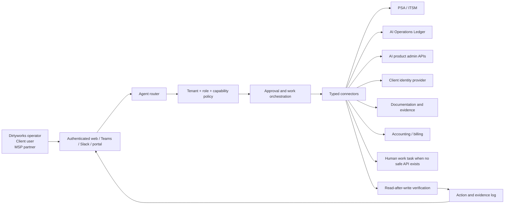

# Agent-operated service platform blueprint

**Date:** 2026-08-26  
**Status:** Working operating and application strategy; platform purchases and product build remain evidence-gated  
**Owner:** Founder / Dirtyworks.ai  
**Related:** [Markdown client repository operating model](../../06-client-delivery/client-operations-platform/markdown-client-repository-operating-model.md), [client operations platform investigation](../../06-client-delivery/client-operations-platform/client-operations-platform-investigation.md), [AI Operations Ledger concept](../../03-offers-and-products/product-strategy/ai-operations-ledger-concept.md), [service delivery model](../../06-client-delivery/service-design/service-delivery-model.md), [data/security/AI schedule](../../09-legal-risk-and-compliance/commercial-contracts/templates/draft-data-security-and-ai-schedule.md), [cost model workbook](../../08-finance/financial-models/dirtyworks-agent-operations-cost-model.xlsx)

> **2026-08-26 architecture update:** One private Git-backed Markdown/personal-wiki repository per client replaces Hudu as the launch-default private operating source. A client-local kgmd graph/MCP and internal interface are derived views. Hudu remains an optional migration path. The earlier Hudu-based cost workbook/scenario is retained as a comparator and must be re-baselined with measured repository, provider and interface maintenance after the synthetic test.

## Executive finding

Dirtyworks.ai can operate its managed service through an AI-agent interface. The practical architecture is not one agent with universal access. It is a policy-controlled command surface over several authoritative systems, with explicit capability contracts, approvals, post-action verification and evidence capture.

Client self-service is viable, but in layers:

1. **Viable immediately:** portfolio and cost views, knowledge answers with provenance, ticket creation/status, training requests, access/licence requests and report downloads.
2. **Viable after a repeated workflow exists:** approvals, standard-role onboarding, seat changes, budget changes and other reversible actions through tested connectors.
3. **Not suitable for unattended self-service:** owner/admin grants, secret disclosure, irreversible deletion, material security/control changes, contract or invoice commitments, incident declarations and critical-service suspension.

The three real implementation choices are:

| Option | What it is | One-time planning range | Monthly TCO at 5 clients | Product implication |
|---|---|---:|---:|---|
| Core managed AI SaaS | Freshdesk client support; one private Markdown/personal-wiki repository and optional kgmd graph per client; 1Password access; native vendor administration, analytics and invoices; lightweight product/access/cost register | $5K–$12K | $1,838 pre-decision comparator | The launch offer and operating system for packaged AI SaaS; re-baseline after the synthetic repository test |
| Hybrid SaaS platform | Adds a normalized AI Operations Ledger, authorization policy, verified writes and a branded client portal | $30K–$60K | $3,460 | Potential differentiator after repeated SaaS-administration evidence |
| Advanced AI workloads | Adds hosted/data/custom AI operations, application/model observability, connector framework, partner tenancy and production hardening | $90K–$180K+ | $6,649 | Separately scoped service-provider work and possible software-product investment |

All monthly figures are CAD planning estimates and include shared platform subscriptions, agent model allowance and normalized platform-maintenance labour. They exclude client AI licences, client implementation/delivery work, frontline support labour, taxes and negotiated vendor terms. The current workbook's core scenario uses the earlier lightweight Hudu/register fallback and does not include quote-only 1Password SaaS Manager licensing. Do not use its Hudu line as the current architecture; replace it with observed Git hosting, approved model, graph/index and interface-maintenance costs after the synthetic test.

The current working direction is to make **managed packaged AI SaaS the core service**. Hosted AI, client data pipelines, retrieval systems, custom agents and model/application operations are advanced projects with separate scope, risk and economics. The core should preserve IDs and interfaces needed for a later hybrid ledger, but should not carry advanced-workload observability or hosting complexity before clients need it.

## The mechanism: an agent as control surface

The agent should answer a question or execute a request by resolving six things before it touches a system:

1. **Tenant:** which customer and legal/data boundary applies?
2. **Actor:** who is asking, in which role, through which authenticated channel?
3. **Intent:** read, request, approve, execute, verify, reconcile or report?
4. **Capability:** does the target connector support the requested action safely?
5. **Policy:** is the action allowed, approval-gated or prohibited for this actor and account?
6. **Evidence:** what source, result, timestamp and verification record will be returned and stored?

This means the agent is not the source of truth. It reads from and writes to systems that remain authoritative for their own records.

## The collection of systems

### System-of-record map

| System role | Authoritative for | Initial candidate | Real alternatives / constraints | Agent behavior |
|---|---|---|---|---|
| Client support desk | Customer contacts, tickets, response targets, support communications, knowledge articles and client portal | Freshdesk Growth initially; Pro when custom objects/portal/reporting justify it | Freshservice/Halo/SuperOps become relevant if Dirtyworks needs deeper ITSM, asset/change or MSP billing functions; a partner may require its own PSA | Read/write only through typed support operations; every action retains the native ticket/request ID |
| Internal operating documentation | Client runbooks, requirements, product/access records, linked resources, processes and evidence references | One private Markdown/personal-wiki repository per client; kgmd/internal interface derived | Hudu remains an optional migration; Freshdesk knowledge may hold client-facing articles; avoid duplicating the same authoritative field | Internal by default; answers cite page/source and freshness; proposed edits enter human-reviewed publication |
| Secrets / privileged access | API keys, admin credentials and technician access | 1Password Teams initially; obtain MSP-edition quote | Hudu or another vault is not selected; maintain a dedicated privileged-access boundary | The model never receives raw secrets; tools use scoped credentials or brokered sessions |
| SaaS product/access/cost management | Products, commercial route, seats, assignments, activity, consumption, invoice, contract, budget, renewal and exception | Demonstrate 1Password SaaS Manager first; Markdown plus a controlled register remains the low-cost fallback | CloudEagle/Zylo are comparators; native vendor data and issued invoices remain authoritative; pricing and SaaS Manager MSP multi-client capability are unproven | Reconciles sources without pretending the aggregate is the vendor tenant or issued invoice; read-only API/MCP access is preferred initially |
| Workflow / integration | Schedules, webhooks, approval steps, retries, exception paths and human tasks | n8n Starter/Pro for early testing | n8n Cloud stores data in Frankfurt; Make, Pipedream or custom workflows are alternatives; self-hosted n8n Business has a large price step | Executes deterministic workflows; the agent selects a published workflow and supplies validated inputs |
| B2B identity | Client organizations, membership, roles, invitations and sessions | Existing PSA portal first; Clerk or native application auth for a branded portal | Clerk basic organizations are free but enhanced B2B roles are paid; enterprise SSO and data/location needs can change the choice | Identity resolves tenant and role before any retrieval or action |
| Agent runtime | Conversation, tool selection, structured outputs and explanations | Thin model-agnostic router using selected LLM APIs | Avoid binding operations to one model vendor; route by task, privacy and cost | Cannot call an unpublished tool or bypass the authorization service |
| Agent observability | Traces, prompt/version history, model cost, evaluations and failures for an instrumented Dirtyworks/client AI application | Not required for packaged-SaaS core; Langfuse Hobby/Core for hybrid/advanced workloads | LangSmith or another OpenTelemetry-compatible tool may fit the final runtime | Does not observe ordinary packaged SaaS use unless the vendor exposes it; never treat traces as the customer record |
| Application monitoring | Errors, latency, connector failures, jobs and alerts for software Dirtyworks operates | Not required for packaged-SaaS core; Sentry Developer/Team for hybrid/advanced workloads | Datadog may fit broader infrastructure/log/APM requirements; native hosting logs may suffice initially | Monitors Dirtyworks-operated applications and integrations, not authoritative SaaS licence spend |
| Application hosting | Internal console, portal/API and lightweight orchestration | Cloudflare Workers paid-plan allowance in the model | Any managed application platform can work; data location, runtime, libraries and team skill decide | Hosts policy and API layers; does not become a credential warehouse |
| Vendor admin systems | Native users, roles, workspaces, usage, costs and audit events | OpenAI, Anthropic, OpenRouter, Microsoft and supported catalogue products | API capability varies by product, plan and commercial relationship | Connector declares supported reads/writes and degrades to a human task when capability is absent |
| Client identity provider | Employment status, groups, manager, joiner/mover/leaver trigger | Customer Microsoft Entra ID or Google Workspace where approved | Some SMB clients will not have mature group or lifecycle data | Remains authoritative for a person's status; the ledger records mappings and exceptions |
| Finance | Invoices, payment status, taxes and accounting entries | Existing accounting system, not selected here | QuickBooks/Xero/PSA billing integration depends on the legal entity and channel seam | Agent may calculate or draft; financial commitment and posting remain approval-gated initially |

### Why multiple systems are not automatically a problem

Multiple systems become a problem when ownership is ambiguous or the same field is edited independently. They are manageable when Dirtyworks defines:

- one authoritative owner for each material field;
- a stable global ID and source-system ID for every linked record;
- permitted synchronization direction;
- freshness and reconciliation expectations;
- an exception queue when two systems disagree;
- an export/offboarding path.

The ledger should not copy everything. It should normalize the cross-system facts the service needs to govern, reconcile and report.

## One interface, several bounded agents

A single user-facing conversation can route to several domain capabilities without exposing that complexity to the user.

| Domain capability | Typical questions | Typical actions | Primary record |
|---|---|---|---|
| Service agent | “What is open?” “Why is this delayed?” | Create/update ticket, add evidence, propose escalation | PSA |
| Portfolio agent | “Who has which product?” “What renews next month?” | Request seat, propose deprovisioning, reconcile inventory | Ledger + vendor admin |
| Cost agent | “What changed?” “Which team is over budget?” | Draft budget change, forecast month end, identify anomaly | Vendor usage + ledger + finance |
| Governance agent | “Is this use approved?” “Which controls are missing?” | Start review, collect evidence, propose control task | Ledger + documentation |
| Knowledge agent | “What is our process?” “Which source supports this?” | Answer with provenance, propose source correction | Customer-approved knowledge source |
| Change agent | “Deploy connector v2 to Client A” | Preview, approve, execute, verify, rollback/compensate | Change record + runtime |
| Reporting agent | “Prepare the monthly review” | Assemble sourced draft and exceptions | Ledger + PSA + cost/evaluation systems |

The router should use deterministic intent and policy checks for action selection. A model may interpret language and prepare parameters; it should not invent an endpoint, role, customer or action.

## Connector capability contract

Each connector must publish machine-readable capabilities. A practical minimum is:

| Field | Purpose |
|---|---|
| `connector_id`, `vendor`, `version` | Identify the adapter and deployed behavior |
| `tenant_binding` | Link the Dirtyworks client to the correct native organization/workspace |
| `operations` | Explicit list such as `users.read`, `user.invite`, `user.suspend`, `usage.read` |
| `risk_class` | Read, request, reversible write, privileged write or prohibited |
| `required_actor_roles` | Roles permitted to request or approve the operation |
| `approval_policy` | None, single approval, customer + Dirtyworks, security approval |
| `idempotency_support` | Prevent duplicate seats, invitations, tickets or changes |
| `dry_run_support` | Return the expected change before execution |
| `verification_method` | Read-after-write check and expected result |
| `rollback_or_compensation` | How the operation is reversed or repaired |
| `rate_limit`, `health`, `last_success` | Operational readiness and degradation state |
| `data_classes`, `regions` | Privacy/security applicability |
| `evidence_output` | IDs, timestamps, result hashes and source links retained after action |

If a vendor does not expose a required API, the connector should not simulate success. It creates a work task with instructions, owner, due date and verification step. This manual fallback is a valid capability state and should be visible in pricing and reporting.

## Action lifecycle

Every write follows the same state machine:

1. **Resolve:** identify tenant, actor, target, native IDs and current state.
2. **Validate:** confirm inputs, supported capability, contract/scope and policy.
3. **Preview:** show the expected difference, cost, affected users and rollback path.
4. **Approve:** collect the required named approval; approval expires after a defined period or material state change.
5. **Execute:** use a short-lived scoped credential and idempotency key.
6. **Verify:** read the target system and compare actual with expected state.
7. **Record:** attach result, timestamps and evidence to the PSA/ledger action record.
8. **Reconcile:** retry safely, create a human exception or compensate when verification fails.

The agent returns `completed` only after verification. A successful API response without a matching authoritative state is `pending verification`, not success.

## Client self-service policy

### Capability levels

| Level | Client can do | Examples | Control |
|---|---|---|---|
| L0 — Read | View approved facts and sourced answers | Product/user inventory, budget use, ticket status, renewal calendar, approved-use list | Tenant and row-level access; source and freshness visible |
| L1 — Request | Create structured work | Request a seat, user onboarding, training, integration, review or report | Service eligibility, required fields and duplicate check |
| L2 — Approve | Approve a prepared change within delegated authority | Team manager approves standard licence; budget owner approves capped increase | Named role, amount/risk limit, expiry and evidence |
| L3 — Execute reversible | Trigger a tested low-risk operation | Send standard invitation, assign approved member role, cancel an unaccepted request | Typed connector, preview, idempotency, verification and rollback |
| L4 — Privileged | Material access/control change | Admin role, connector authorization, DLP/retention change, secret rotation | Dirtyworks + customer admin/security approval; usually operator-executed |
| L5 — Restricted | Destructive, legal or crisis action | Delete tenant, final invoice/contract change, breach declaration, critical suspension | Never unattended; authorized human decision and separate runbook |

### Initial self-service catalogue

Launch a client interface with L0 and L1 only:

- ask questions about the managed portfolio and operating procedures;
- see product, user, role, renewal and support status;
- view usage/cost summaries and budget alerts;
- open and track support requests;
- request licences, onboarding/offboarding, training and changes;
- approve prepared requests when the actor has delegated authority;
- download a monthly operating report and export client-owned records.

Do not begin with a universal “do anything” chat. Use the conversation to discover intent, then show a structured work card with target, expected result, cost, owner and approval state.

### Is a client platform economically viable?

Yes, if it reduces a repeated operating job and supports retention or partner distribution. It is not viable merely because it looks differentiated.

The first portal should be built only when at least one of these is true:

- three active clients use the same request/status/approval workflow;
- one MSP partner needs a branded or federated experience for a funded pilot;
- manual request routing/reconciliation exceeds eight hours per month or consumes at least 10% of recurring gross profit;
- a signed client needs a capability not safely available in the chosen PSA portal.

The portal should not replace the PSA. It should provide a better portfolio and approval experience while synchronizing service work to the PSA.

## Cost model

### Current public-price inputs

| Component | Public planning price | Important caveat |
|---|---:|---|
| Freshdesk Growth / Pro | USD $19 / $55 per agent/month, annual billing | Growth covers core ticketing/portal; Pro adds custom portal/objects and advanced reporting/routing; MSP terms require confirmation |
| Hudu | USD $27 per operator/month, annual billing | Client portal users are free; REST API; built-in vault does not remove the need to define a secrets boundary |
| 1Password Teams Starter | CAD $29.95/month, annual billing, ten members | MSP edition is consumption-based but requires distributor pricing |
| n8n Starter / Pro / Business | EUR €20 / €50 / €667 per month, annual billing | Cloud data is in Frankfurt; Business is self-hosted and creates a large price step |
| Supabase Pro / PITR | USD $25 / $100 per project/month | Team plan is USD $599 when platform-level audit/access/compliance controls are needed |
| Clerk Enhanced B2B | USD $85/month, annual billing | Basic organizations and roles are available free; advanced roles and unlimited members drive the add-on |
| Cloudflare Workers paid plan | USD $5/month plus metered usage | Treat this as hosting allowance, not the full application cost |
| Langfuse Core / Pro | USD $29 / $199 per month plus usage | Enterprise audit logs and advanced team controls cost substantially more |
| Sentry Team / Business | USD $26 / $80 per month plus usage | Included event quotas and retention must be checked against production volume |

The workbook uses Bank of Canada 2026-08-25 indicative rates of CAD 1.3839 per USD and CAD 1.6151 per EUR. Vendor prices and rates are editable inputs.

### Monthly total cost of ownership

| Option | Clients | Software + agent use | Platform maintenance labour | Monthly TCO | TCO / client |
|---|---:|---:|---:|---:|---:|
| Core managed AI SaaS | 1 | $226 | $750 | $976 | $976 |
| Core managed AI SaaS | 5 | $488 | $1,350 | $1,838 | $368 |
| Core managed AI SaaS | 15 | $865 | $2,850 | $3,715 | $248 |
| Hybrid SaaS platform | 1 | $592 | $1,688 | $2,279 | $2,279 |
| Hybrid SaaS platform | 5 | $1,023 | $2,438 | $3,460 | $692 |
| Hybrid SaaS platform | 15 | $1,788 | $4,313 | $6,101 | $407 |
| Advanced AI workloads | 1 | $997 | $3,900 | $4,897 | $4,897 |
| Advanced AI workloads | 5 | $1,549 | $5,100 | $6,649 | $1,330 |
| Advanced AI workloads | 15 | $3,782 | $8,100 | $11,882 | $792 |

The model values platform-maintenance time at CAD $150/hour. At five clients, it assumes 9 hours/month for core managed AI SaaS, 16.25 for the hybrid and 34 for advanced workloads. At a half-time founder capacity of roughly 87 hours/month, that is about 10%, 19% and 39% of available time before sales or client delivery. This is why the core must stay focused on packaged SaaS administration.

### One-time implementation

| Option | Midpoint model | Practical range | Likely calendar time | Primary uncertainty |
|---|---:|---:|---:|---|
| Core managed AI SaaS | $8,000 | $5K–$12K | 2–4 weeks | vendor admin/export coverage, billing rail and MSP support seam |
| Hybrid SaaS platform | $44,000 | $30K–$60K | 8–16 weeks | authorization, data model and connector depth |
| Advanced AI workloads | $132,500 | $90K–$180K+ | 5–9 months | security, tenancy, data/model operations, connector support and product ownership |

The core managed AI SaaS stack fits the current experiment budget. A tightly scoped hybrid can fit only near the upper end. Advanced workload infrastructure exceeds the current capital envelope unless a client/MSP funds a specific project.

## Implementation phases and release gates

### Phase A — operating interface prototype

**Purpose:** prove that operators can retrieve and act on sourced client information without adding another system of record.

Build/configure:

- two isolated synthetic-client repositories using the published Markdown schema, personal-wiki review and client-local kgmd corpus, plus Freshdesk and the controlled product/access/cost register;
- internal authenticated agent with read access to Freshdesk, published Markdown/kgmd and selected native vendor administration/usage surfaces;
- ticket/request creation and draft work cards;
- tenant, role, source/freshness and action audit fields;
- no client portal and no direct vendor writes.

Gate:

- two scripted platform demonstrations complete;
- one synthetic client dry run passes;
- the live MSP responsibility seam is known;
- every answer identifies source and freshness;
- no raw secret enters a model context.

### Phase B — verified operator actions

**Purpose:** reduce internal administration without moving risk to the client.

Add:

- one identity/product connector and one cost/usage connector;
- typed preview/approve/execute/verify lifecycle;
- idempotency and exception queue;
- connector health and weekly reconciliation;
- operator approval for all writes.

Gate:

- at least 50 synthetic/reversible action tests with no cross-tenant or duplicate action;
- 100% of successful actions have read-after-write verification;
- failed verification creates a visible work item;
- manual effort reduction is measured.

### Phase C — client read/request portal

**Purpose:** improve transparency and reduce request friction.

Add:

- branded tenant portal or thin layer over PSA portal;
- L0 read and L1 request capabilities;
- portfolio, cost, renewal, approved-use and service status;
- customer export and correction request;
- basic B2B roles.

Gate:

- three clients share the workflow, or one funded MSP/client requires it;
- row-level tenant isolation and authorization tests pass;
- contract/privacy notices describe data, subprocessors, audit and support boundary;
- portal reduces request/reconciliation work or improves a measured renewal/value outcome.

### Phase D — delegated self-service

**Purpose:** permit narrow client execution with defined authority.

Add:

- L2 approvals and selected L3 reversible actions;
- delegated authority by role, product, risk and budget;
- dual approval for material changes;
- client-visible action evidence and status;
- rollback/compensation runbooks.

Gate:

- each action has a stable API, idempotency and verification path;
- at least 100 tested executions per action type or a risk-based equivalent;
- error, reversal, support and cost rates meet defined thresholds;
- customer and Dirtyworks contract/control owners approve the action class.

### Phase E — partner control plane

**Purpose:** support co-managed or white-label MSP operations.

Add only after partner evidence:

- parent/partner/customer tenancy and branding rules;
- federated ticket/change handoff;
- partner operator roles and liability/responsibility seam;
- portfolio benchmarking only with explicit permission and aggregation rules;
- partner billing/usage allocation where commercially agreed.

Gate:

- two MSP partners need the same model or one anchor partner funds it;
- client ownership, data role, support SLA, claims and exit terms are contractually resolved;
- the platform economics remain attractive after partner margin and support overhead.

## Operating controls

### Non-negotiable controls

- Customer production tenants and data remain customer-owned by default.
- Every request carries tenant and actor context derived from authenticated identity, never conversational text alone.
- Secrets are referenced by handle and injected into a connector runtime; they are never displayed to the model or user.
- All connector operations use least privilege and separate read from write credentials where supported.
- Retrieval enforces tenant and record-level authorization before content enters the model.
- Actions require typed parameters; free-form model text cannot become an API body.
- Privileged or destructive operations fail closed on ambiguity, connector degradation or missing approval.
- Logs redact sensitive content but retain actor, target, intent, policy decision, native IDs, timestamps and result.
- Prompt/tool/runtime releases have versioned evaluation and rollback.
- A client can export its operating records and evidence references in usable formats.

### Operating cadence

| Cadence | Work |
|---|---|
| Continuous | connector health, authentication failures, job failure, cross-tenant-denial and unusual cost alerts |
| Daily | unresolved action exceptions, failed verification, urgent ticket and incident queue |
| Weekly | vendor-to-ledger reconciliation, automation failures, stale source and approval aging |
| Monthly | product/user/access/cost review, service performance, action success/reversal rate, client report |
| Quarterly | supported-use review, access recertification, connector capability review, subprocessor/data-location review and product roadmap gate |

## Metrics that decide whether to build further

Measure by client, connector and action type:

- operator minutes per request and per active portfolio;
- self-service containment rate, excluding abandoned/failed requests;
- successful verified action rate;
- duplicate-action, reversal and manual-exception rate;
- stale/disputed records and time to reconcile;
- connector maintenance hours per release/month;
- support tickets caused by the platform;
- agent model and platform cost per active client;
- cross-tenant authorization test failures—target zero;
- renewal, expansion or partner evidence attributable to the interface;
- gross-profit impact after normalized platform labour.

Build the next layer only when these measures show a repeated business advantage. Usage alone is not evidence of value.

## Real options for the sponsor

### Option 1 — operations first

Use Freshdesk for the client-facing portal and support queue; private per-client Markdown repositories and 1Password remain internal. Manage vendor access, adoption, cost, invoices and renewals through native admin surfaces plus the controlled register. Use personal-wiki for reviewed publication and optionally kgmd for derived read/search. This spends the least capital and directly tests the launch offer.

### Option 2 — design the hybrid now, release after proof

Define the ledger IDs, connector contract, action lifecycle and portal API now, but implement only the read-first internal slice. This costs more design time early but reduces rework if self-service demand appears. It is the closest fit with the current AI Operations Ledger strategy.

### Option 3 — anchor-funded client/MSP platform

Let a named client or MSP fund a constrained hybrid/control-plane scope. This can accelerate product evidence but creates roadmap, white-label, support, data-role and IP obligations that must be priced and contracted explicitly.

### Option 4 — external platform assembly only

Do not build a client application. Standardize on Freshdesk for client support, private Git-backed Markdown repositories for internal operating knowledge, 1Password for privileged access, native vendor administration and a controlled product/access/cost register. A thin local/internal reader and kgmd MCP remain derived tooling rather than a client application. This can support a services company indefinitely, but cross-client portfolio normalization and a differentiated partner experience remain weaker.

No choice must be made permanently. The important current decision is how much interface and schema design to preserve before delivery evidence exists.

## Immediate investigation and implementation work

1. Build two synthetic per-client repositories from the [template pack](../../90-templates/client-operations-repository/README.md); validate personal-wiki publication, provider/retention rules, client-local kgmd indexing, cross-client denial, recovery and offboarding.
2. Use the synthetic repositories to prototype ten sourced read questions and five request/work-card flows with page/freshness citations and no direct vendor writes.
3. Run an MSP-native PSA or flexible ITSM demonstration only when the live MSP responsibility seam requires an integration beyond Freshdesk/Markdown.
4. Obtain separate 1Password Enterprise Password Manager MSP and SaaS Manager quotes for one client, five clients and the service-provider model; add the accepted structure to the workbook only after commercial and tenant-isolation validation.
5. Select two target vendor connectors based on actual catalogue demand, not technical novelty.
6. Measure manual time for inventory, onboarding, cost review and monthly reporting before automating.
7. Decide the live MSP record seam before purchasing or building a portal.

## Open decisions and evidence gaps

- Which PSA must Dirtyworks use for the live MSP opportunity?
- Does the first direct segment need Canada-only data handling, Canada-preferred handling or disclosed vendor regions?
- Which two AI products produce the first repeated admin and usage workflow?
- Will the portal be Dirtyworks-branded, partner-branded or federated?
- Which customer roles may approve seat, budget, use-case and integration changes?
- Are client members typically below the free/basic B2B identity limits?
- Will the platform be a service feature, paid add-on or separately licensed product?
- Who funds connector maintenance when a vendor changes its API or product model?

These are not blockers for the read-first prototype. They become release gates before vendor writes, production client data or white-label deployment.

## Research sources

### Operating platforms and infrastructure

- Freshdesk pricing and capabilities: <https://www.freshworks.com/freshdesk/pricing/>
- Halo pricing and included modules: <https://www.usehalo.com/pricing>
- SuperOps PSA pricing: <https://superops.com/psa-software/>
- Hudu pricing, portal and API: <https://www.hudu.com/pricing>
- 1Password business/MSP pricing: <https://1password.com/pricing/business>
- n8n pricing, execution model and hosting location: <https://n8n.io/pricing/>
- Supabase pricing, backup and authentication controls: <https://supabase.com/pricing>
- Clerk B2B identity pricing: <https://clerk.com/pricing>
- Cloudflare Workers pricing: <https://developers.cloudflare.com/workers/platform/pricing/>
- Langfuse pricing and observability: <https://langfuse.com/pricing>
- Sentry pricing and application monitoring: <https://sentry.io/pricing/>
- Bank of Canada exchange rates: <https://www.bankofcanada.ca/rates/exchange/daily-exchange-rates/>

### Vendor administration examples

- OpenAI organization admin API: <https://developers.openai.com/api/reference/resources/admin/subresources/organization/subresources/admin_api_keys>
- OpenAI organization usage API: <https://developers.openai.com/api/reference/python/resources/admin/subresources/organization/subresources/usage>
- Anthropic organization administration: <https://platform.claude.com/docs/en/manage-claude/overview>
- Anthropic usage and cost API: <https://platform.claude.com/docs/en/manage-claude/usage-cost-api>
- OpenRouter management keys: <https://openrouter.ai/docs/guides/overview/auth/management-api-keys>
- Microsoft 365 Copilot admin reports: <https://learn.microsoft.com/en-us/copilot/microsoft-365/microsoft-365-copilot-reports-for-admins>

## Stuck / unable-to-continue record

No active execution blocker was encountered.

Public list prices do not resolve commercial quotes, MSP discounts, onboarding fees, data residency, API entitlements or vendor resale rights. The cost workbook therefore exposes list-price and exchange-rate assumptions and treats quotes and connector tests as gates. The live MSP system-of-record requirement and the first two real product connectors remain unknown, but the read-first architecture and synthetic prototype can proceed without guessing them.
